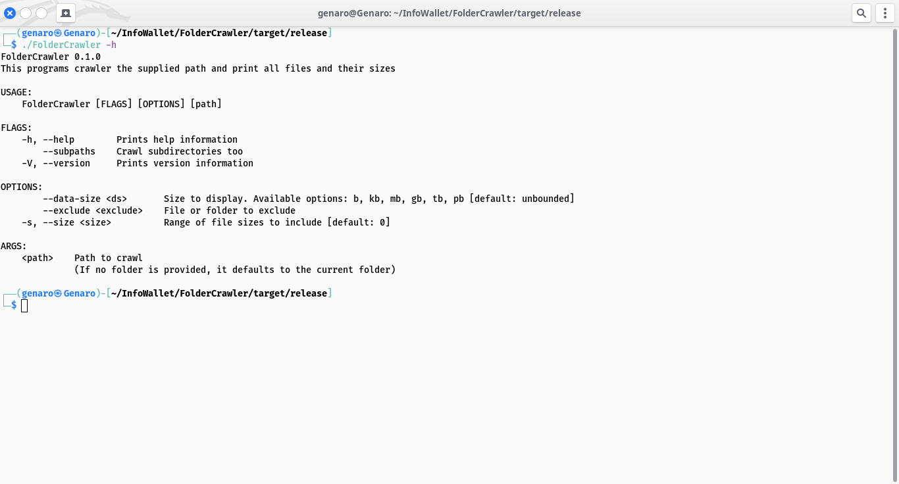
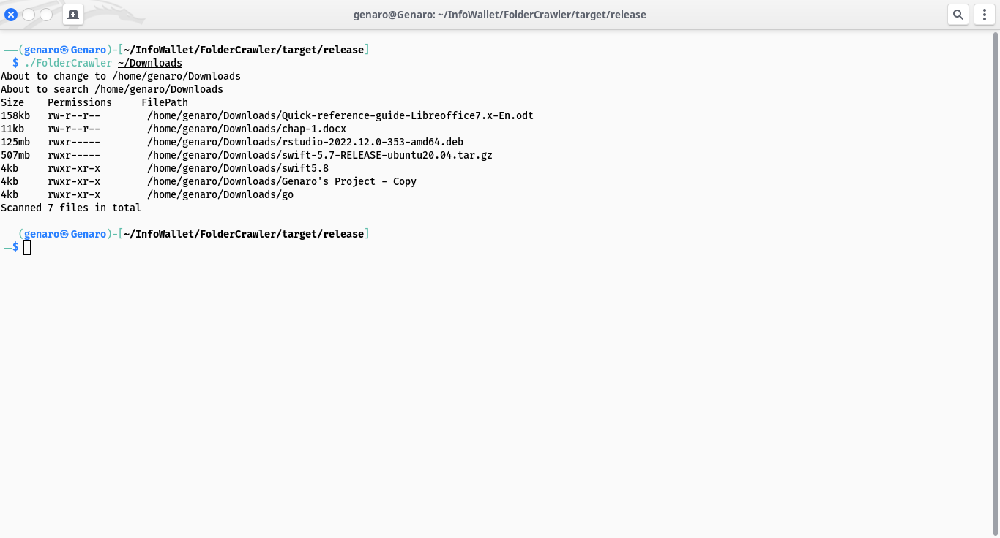

# FolderCrawler

This project grew out the frustration of always remembering the different commands for listing out files and their respectively filesizes. I wrote this project using one of favourite programming languages: this time Rust, to make it easier to list out files and their filesizes.

It was tested on a linux specifically on Kali linux :) but I think it's applicable on any *nix system capable of compiling rust code.

## Requirements

Any *nix system with a working Rust installation

Rust 2021 or higher.

## Building
Change your working directory to the root of the FolderCrawler directory

``cd /path/to/FolderCrawler/``

Run this command and wait for it to finish, to compile it for release mode

``cargo build -r``

The compiled program will be stored at ``/path/to/FolderCrawler/target/release`` folder

## Usage

After compilation, just run it with the ``-h`` or ``--help`` flag to see the full help information 

Example

``/path/to/FolderCrawler ~/ --subpaths --ds mb --size 100 --exclude ~/Downloads``

This preceding example will list out files in the current user home directory and its subdirectories filtering out only files of 100 megabytes and above while removing files from the downloads folder

## Features

- Crawls subdirectories 
- Lists out the filesize and its full filepath 
- Prints the total number of file crawled
- Skips directory supplied through the ``--exclude`` option flag
- Filter out files according to its filesize
- Control+C automatically quit the application

## Screenshots

## Feedback

If you have any feedbacks, issues, code improvements of any sort, contributions, or even collaborations on any of your projects.

Please reach out to me at [here](mailto:christian25589@gmail.com)
