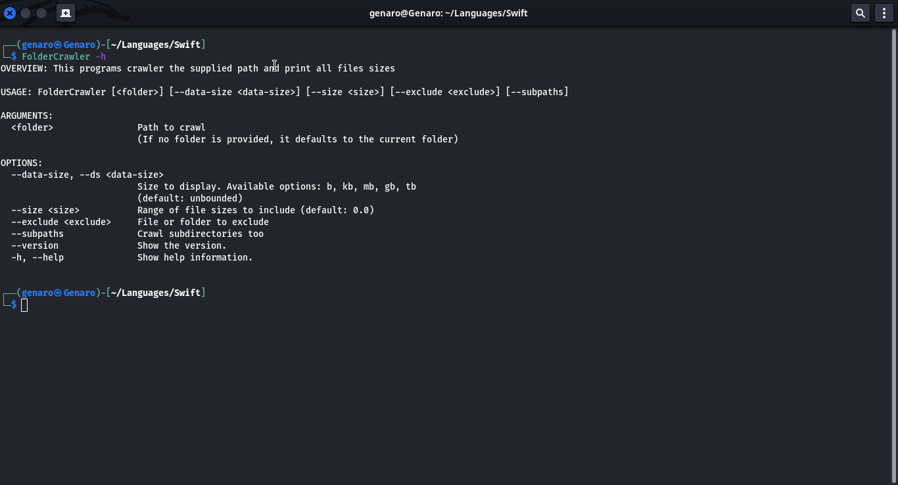
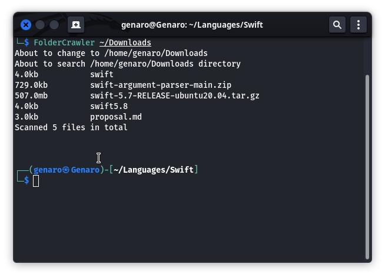

# FolderCrawler

 

 

A description of this package. 

## Features

- Crawls subdirectories 
- Lists out the filesize and its full filepath 
- Prints the total number of file crawled
- Skips directory supplied through the ``--exclude`` option flag

## Screenshots

## Feedback

If you have any feedbacks, issues, code improvements of any sort, contributions, or even collaborations on any of your projects.

Please reach out to me at [here](mailto:christian25589@gmail.com)
